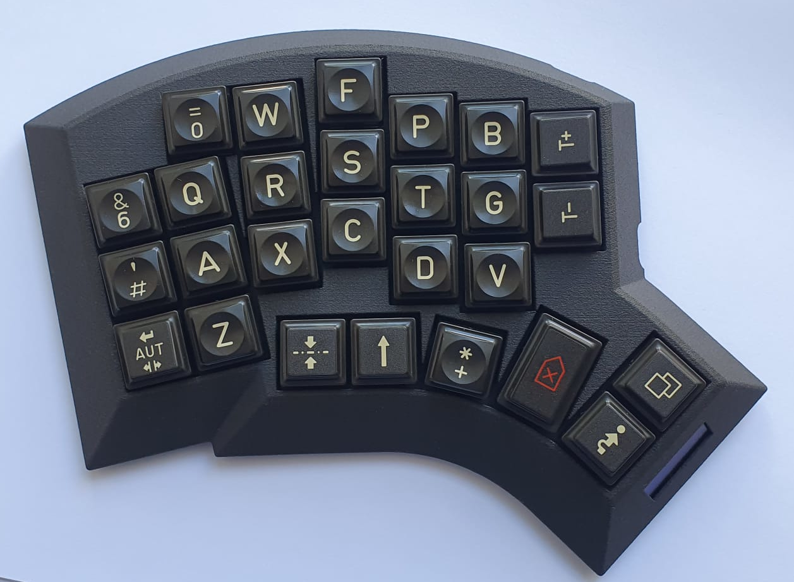
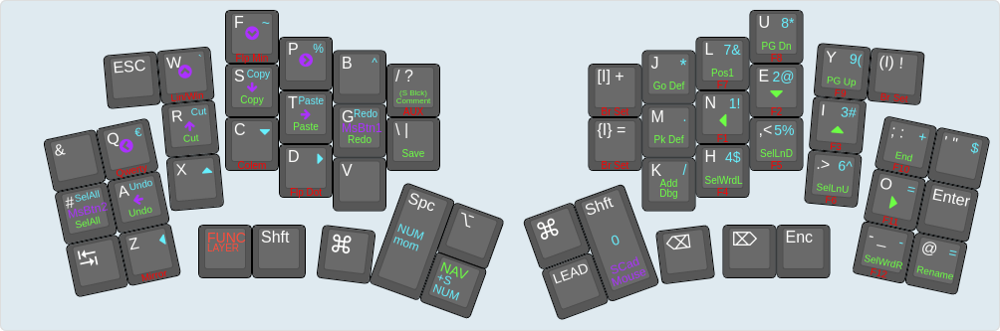
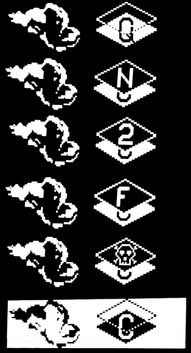

An ergonomic 54-key hand wired split keyboard running QMK on the Elite-C microcontroller, living inside its 3D-printed case.

## Features
- 54-keys, split, Elite-C microcontroller, column stagger, ring finger (5°) and pinky (12°) splay, slightly tented case (2° toward user and 3° outward), support for one rotary encoder per half, one 128x32 OLED per half, hot-pluggable RJ10 connection between halfs and a transport case

Keyboard Maintainer: [@vvhg1](https://github.com/vvhg1)   
Build guide and 3D files are at [https://github.com/vvhg1/fisk_build_guide.git](https://github.com/vvhg1/fisk_build_guide.git)
## Acknowledgements
This keyboard draws inspiration from many sources and would not have been possible without the works of others.
Some that deserve to be mentioned above all else are:
- the famous Kyria by Thomas Baart, [splitkb.com](https://splitkb.com)

    The aggressive column stagger, the thumb cluster and the general shape are inspired by the Kyria. The use and placement of a rotary encoder also comes from the various Kyria layouts floating around. Even the two extra index finger keys draw inspiration from here, as there was enough space in my 3D mock-up due to the different MCU placement and I just love dedicated keys for brackets.
    Would I not have gone down the route of designing a keyboard from scratch, the Kyria would have been one of the most tempting options of all the split keyboards I have come across in my research.
    
- the [Architeuthis dux](https://github.com/tapioki/cephalopoda/tree/main/Architeuthis%20dux) by [@tapioki](https://github.com/tapioki)

    Going one step beyond a mere column stagger and adding column splay immideately made sense to me and seemed like the next logical step. The even more extreme pinky stagger was a welcome encouragement in the design process of the physical layout and the column splay turned out to feel very natural.
    
- the [Lotus58 case design](https://www.thingiverse.com/thing:4768218) by Matt James, a welcome breather from the usual blocky, vertical wall case designs.

- QMK wizardry by (in alphabetical order): [@andrewjrae](https://github.com/andrewjrae), [@drashna](https://github.com/drashna), [@GauthamYerroju](https://github.com/GauthamYerroju), [@JReneHS](https://github.com/JReneHS), [@rafaelromao](https://github.com/rafaelromao)   
   
**Note:** In case I have forgotten to mention someone or a reference to an author's work, please let me know and I will happily correct it.
## Keymap

This is my personal keymap, main features include: one rotary encoder, Colemak-dh and Qwerty (both have somewhat modified symbols), layers, custom leader key, custom layer logic, custom oneshot modifiers, end of sentence, case modes (CAPSWORD, x_case, NUMW0RD), power brackets and dynamic info on both OLED displays.

**Note:** This keymap assumes US ANSI layout on Windows OS. I have not tested it on other OS and shortcuts are the Win ones, but it should not be overly complicated to adapt.

**Note:** There is also a default keymap included, in case anyone wants to start with a clean slate.

### Leader Key with repeatable sequence groups
Custom leader key implementation, original author is [@andrewjrae](https://github.com/andrewjrae).  
I made a few changes:   
- for one I changed the leader key to toggle, so it can be used to escape the leader sequence.   
- When activated, the leader key changes layers back to the default layer if it is not the highest layer (can be disabled by setting `CUSTOM_LEADER_TO_DL = no` in `rules.mk`).
- I made a few changes to how the leader sequence is displayed on the oled. If the sequence gets too long, it starts scrolling with every new key press, only displaying the last n (of course this value can easily be changed by adjusting `LEADER_DISPLAY_LEN`) keys.
- Probably the biggest aspect is more a different approach of implementation/usage. For me the biggest limitation of the leader key was that the action was not easily repeatable, so I added open ended sequences. When a leader sequence is finished, the action is executed, as one would expect, but a repeatable leader sequence then keeps listening instead of terminating, so if the last key in the sequence is tapped again, the action is being repeated. This is done so long as no other key is pressed. If an other key gets pressed, the sequence is terminated and the key is processed as normally. For actions like next/previous or up/down actions, I let both corresponding keys through, e.g. if `w` were up and `s` down, pressing `s` after `w` would not disable the leader function but instead perform the down action.
- I also fiddled around with the logic in general to adapt it to my use case.
#### Leader Key Sequences
##### General stuff
|        |    |              |            |
| ------ | -- | ------------ | ---------- |
|        | WS | Start Menu   |            |
| Leader | WM | Context Menu |            |
|        | Q  | Close Tab    | Repeatable |
##### Vscode stuff
|        |         |                        |            |
| ------ | ------- | ---------------------- | ---------- |
|        | E       | Show Tooltip (C+K, C+I)|            |
|        | I       | Prv Editor Tab         | Repeatable |
|        | L       | Peek Def (Alt+F12)     |            |
|        | SHIFT+L | Go to Def (F12)        |            |
|        | N       | Nxt Editor Tab         | Repeatable |
|        | O       | Select all occurrences |            |
|        | R       | Run W/O Debug (ctrl + F5)|          |	
|        | SHIFT+R | Stop Debugging (shift + F5)|        |
|        | T       | Toggle Terminal        |            |
|        | VU      | Move Line Up           | Repeatable |
| Leader | VE      | Move Line Dn           | Repeatable |
|        | VMN     | Move Editor Left       | Repeatable |
|        | VMI     | Move Editor Right      | Repeatable |
|        | VFN     | Focus Left             | Repeatable |
|        | VFI     | Focus Right            | Repeatable |
|        | VCU     | Copy Line Up           | Repeatable |
|        | VCE     | Copy Line Dn           | Repeatable |
|        | VP      | Format selection       | Repeatable |
|        | VAP     | Format all             |            |
|        | Z       | Zen Mode toggle        |            |
|        | Enter   | Command Palette        |            |

##### CaseModes
|        |   |                |
| ------ | - | -------------- |
|        | C | Caps Word      |
| Leader | S | Snake Case     |
|        | X | Caps and Snake |
|        | N | Num Word       |
|        | D | XCase w. Shift |
##### Brackets
|        |              |                    |            |
| ------ | ------------ | ------------------ | ---------- |
|        | {}           | {                  | Repeatable |
|        | SHIFT + {}   | }                  | Repeatable |
|        | \[\]         | \[                 | Repeatable |
| Leader | SHIFT + \[\] | \]                 | Repeatable |
|        | ()           | (                  | Repeatable |
|        | SHIFT + ()   | )                  | Repeatable |
|        | '            | Power Brackets on  |            |
|        | SHIFT+'      | Power Brackets off |            |
##### Encoder Mode
Disabled by default, can be enabled by uncommenting the corresponding block in `leaderfuncs.c` (at the very end).
|        |    |                      |
| ------ | -- | -------------------- |
|        | EH | Horizontal scroll    |
|        | EV | Vertical scroll      |
| Leader | EE | Nxt/Prv Editor group |
|        | ET | Nxt/Prv Tab          |
|        | EP | Paging               |
|        | EW | Word selection       |
##### Macro stuff
Disabled by default, can be enabled by setting `DYNAMIC_MACRO_ENABLE = yes` in `rules.mk` (adds about 550 b)   
|        |    |                      |
| ------ | -- | -------------------- |
|        | MR | Record macro         |
| Leader | MS | Stop macro recording |
|        | MP | Play macro           |
##### Umlaut stuff (probably not so interesting for most people)
|        |    |         |
| ------ | -- | ------- |
|        | UA | Ä       |
| Leader | UO | Ö       |
|        | UU | Ü       |
|        | US | Eszet ß |

<!-- ##### Reset	
| Leader | QRK |  Reset Keyboard for flashing |
|--------|-----|------------------------------| -->

### Custom Layer logic
This also works with `NO_ACTION_TAPPING` defined.
Layers toggle on tap and momentarily activate when held. Memory of previously active layer, returning to it only if the layer was activated momentarily, if the layer was activated as toggle, deactivating will revert to the base layer. The hold has a timer, so a longer hold is automatically recognised as a momentary hold and not as a tap. This behaviour is somewhat similar to the custom one shot modifiers.

### Custom one shot modifiers
Light weight modifiers that work when `NO_ACTION_TAPPING` and `NO_ACTION_ONESHOT` are defined. They behave like normal modefiers when held, but when tapped they modify only the next key. The one shot function is disarmed when tapped again, or when tapped and then held behave like normal modifiers.
One shot is not disabled by: space, del, backspace and modifiers. That means that e.g. `CTL` + `SHIFT` + `A` do not have to be chorded but can be hit in sequence.
When toggled on and then off again without any key press in between or when disarming on key up after the one shot timer elapsed, ESC is sent to refocus.

### End Of Sentence
This makes the transition between sentences a little smoother. Instead of typing `.`-`SPACE`-`SHIFT`- typing -`..`- has the same effect, the next character will be shifted. The idea is not mine, I think I first saw it in [@precondition](https://github.com/precondition)'s [Dactyl manuform keymap](https://github.com/precondition/dactyl-manuform-keymap). The implementation however is my work and will work without making use of One Shot Shifts.
### Case Modes
Case modes are slightly adapted to account for NO_ACTION_TAPPING, NO_ACTION_ONESHOT and for my use case.
Description is largely the original by [@andrewjrae](https://github.com/andrewjrae).
#### Caps Word
Caps word is a feature [@andrewjrae](https://github.com/andrewjrae) came up with a while back that essentially acts as a caps lock key but only for the duration of a "word".
This makes macros like =CAPS_WORD= really easy to type, it feels a lot like using one shot shift, and it pairs very nicely with it.
What defines a "word" is sort of up for debate, he started out with a simple check to see if he had hit space or ESC but found that there were other things he wanted to exit on, like punctuation.
So now it detects whether `space`, `backspace`, `-`, `_`, or an alphanumeric is hit, if so we stay in caps word state, if not, it gets disabled. He also checks for mod chording with these keys and if you are chording, it will also disable caps word (e.g. on `Ctrl+S`).

The actual behavior of when to disable caps word can be tweaked using `terminate_case_mode()`.

`By default caps lock is used as the underlying capitalization method, however you can also choose to individually shift each keycode as the go out. This is useful for people who have changed the functionality of caps lock at the OS level. To do this simply add #define CAPSWORD_USE_SHIFT in you config.h.`

**Note:** I switched that around so that shift is now default, unless `#define CAPSWORD_USE_CAPS` is defined.

To use this feature `enable_caps_word()` or `toggle_caps_word()` can be called from a macro, combo, tap dance, or whatever else you can think of.

#### X Case
X-Case is an idea from [@baffalop](https://github.com/baffalop), it takes the idea of caps word but applies it to different kinds of programming cases.
So for example say you want to type `my_snake_case_variable`, rather than pressing `_` every time (which is almost certainly behind a layer), you can hit a "snake_case" macro that turns all your spaces into underscores, it can then be exited using whatever you define as the end of a word in `terminate_case_mode()`.
[@baffalop](https://github.com/baffalop) also suggested using a double tap space as an exit condition, which is also implemented here.

Now this is just a snake case macro, what if you want kebab-case? Well x-case can be applied here, but now instead of replacing space with an `_` it replaces it with a `-` instead.
The idea of x-case is to make it easy to achieve these kinds of case modes. For example to enable snake_case mode, you just need to call `enable_xcase_with(KC_UNDS)` and for kebab it's simply `enable_xcase_with(KC_MINS)`.

So you might ask, what about camelCase? Well, we got that covered too! If you call `enable_xcase_with(OSM(MOD_LSFT))`, your spaces will be turned into one shot shifts enabling you to write camelCase.

Finally, because you might want to use this for some more obscure use cases, there's the `enable_xcase()` function.
This function will intercept your next keystroke and use that as it's case delimiter.
For example, calling `enable_xcase()` and then hitting your `/` key will result in your spaces begin turned into slashes. (This is the equivalent of calling `enable_xcase_with(KC_SLSH))`)

To make this a little more flexible, you can define a default separator so that typing non-symbols defaults to that separator.
This default separator can be configured with the `DEFAULT_XCASE_SEPARATOR` macro, by default it is `KC_UNDS` for snake_case.
To enable this you need to specify what keys will enter default mode, this configured with the `use_default_xcase_separator()` function.

#### Num Word

NUMWORD is a similar concept by Joshua T. aka [@replicaJunction](https://github.com/replicaJunction). I added NUMWORD to my Case Modes, which also means, that I changed the means of activation, as all Case Modes are activated by leader key sequences. This can be combined with X-Case. To use this feature `enable_num_word()` or `toggle_num_word()` can be called from a macro, combo, tap dance, or whatever else you can think of.

**Note:** The implementation of NUMWORD requires that the keyboard's layer definitions be accessible in a header file. In this case, the layer definitions are in enumlayers.h, so I make them accessible by adding `#include enumlayers.h` in casemodes.c.

### Power Brackets
These are bracket pairs of different types, single- and double-quote pairs. On a simple key press an empty pair with the cursor placed inside the brackets like `(I)`, `{I}`, `[I]` is produced. This does not conflict with the way Vscode handles empty brackets. The behaviour can be toggled to bracket pairs with the cursor to the right of the pair by setting the flags `outside_cursor_op = true;` for opening brackets, `outside_cursor_sq = true;` for square brackets and `outside_cursor_cr = true;` for curly brackets. There is a keybinding on the Function layer for this.    
When modified with ALT they `(wrap)` `{the}` `[previous]` `"word"` without having to select the word first.  

**Note:** I mapped left brackets to `Leader`, `corresponding bracket key` and right brackets when modified with `SHIFT`.

**Note:** Due to the ALT modifier, ESC is sent to neutralise the  ALT keypress  focus change.
<!-- ### Other
I made the Grave key, which is a dead key in the US Intl. layout, active again as I don't need the dead key behaviour of it and I find it annoying. To revert to the standard behaviour, simply comment out the `case KC_GRAVE:` switch case in keymap.c. -->

## OLEDs
I added some graphics to make the info easily recognisable as this build only has a 128x32 display.

The modifier key design originally comes from [@JReneHS](https://github.com/JReneHS), source: [https://github.com/JReneHS/crkb_conf](https://github.com/JReneHS/crkb_conf). I enlarged the icons from 2 characters high to 3 characters while keeping the aspect ratio and added a Leader key icon. As I find the COMMAND icon a lot prettier than the boring CONTROL icon, I decided to use it despit running Windows. I also took some inspiration for my layer indicator from him.   
If mirroring is on, instead of cramming yet another icon into my very limited OLED real estate, the whole screen is inverted.

### OLED info
#### Left-side OLED displays dynamic data:   
  
- Base Layer
    - Colemak-dh
    - Qwerty
    
- Current Layer
    - Colemak-dh
    - Qwerty
    - Navigation
    - Numbers
    - Functions
    - Aux
- Mirroring inverts screen
    
- Case Modes (not shown in image)
    - C for CASEMODE
    - S for _snake_case_
    - N for Numw0rd
    - X for _CAPS_AND_SNAKE_CASE
    
#### Right-side OLED displays dynamic data:  

- Current modifier status
- Current rotary encoder mode
    - Word navigation
    - Lef/right
    - Up/down
    - Paging
    - Vscode: focus editor left/right
    - Vscode: select tab left/right
        
- Leader key sequence

### Cheap trick OLED
As I was pressed for space with console/debug enabled, I got rid of something rather unnecessary, instead of disabling more core features in my keymap than absolutely neccessary...
OLED will save some space at compile time by disabling most graphics. Information is still being displayed, just not in a pretty way. Although it helps, it won't be enough with all bells and whistles turned on...

## Mirroring 
Is supported for one hand typing, can be disabled in rules.mk (SWAP_HANDS_ENABLE)

## Rotary Encoder

Press the encoder to cycle between:
- Next / Previous Tab
- Vscode Shrink / Expand Selection
- Word Nav (Ctrl + Left / Right)(disabled by default, can be enabled by uncommenting the corresponding blocks in `encoder_utils.c`, `encoder_utils.c` and `oled_utils.c`)
- Left / Right (disabled by default, see above)
- Up / Down (disabled by default, see above)
- Page Up / Page Down (disabled by default, see above)
- Vscode Next / Previous Editor (disabled by default, see above)
When holding `SHIFT` while cycling, modes are cycled counter-clockwise.

## Installation

Clone the [QMK firmware](https://github.com/qmk/qmk_firmware) and place this repo in `qmk_firmware/keyboards/handwired/fisk`.
Brand new to QMK? Start with our [Complete Newbs Guide](https://docs.qmk.fm/#/newbs).
## Make

### Setting Handedness
In order to compile the correct font for each side, `#define IS_LEFT` in `config.h` for the left side and comment it out for the right side.
The firmware uses [handedness by EEPROM](https://docs.qmk.fm/#/feature_split_keyboard?id=handedness-by-eeprom) as default and it must be *configured once* on each side. 
Make example for this keyboard (after setting up your build environment):

For Elite-C or compatible controllers using `DFU` bootloader, make sure the line `BOOTLOADER = atmel-dfu` is in the `rules.mk` file and use the following make commands:

    make handwired/fisk:vvhg1:dfu-split-left
    make handwired/fisk:vvhg1:dfu-split-right
For Pro micros, delete the line `BOOTLOADER = atmel-dfu` from the `rules.mk` file. The make commands are:

    make handwired/fisk:vvhg1:avrdude-split-left
    make handwired/fisk:vvhg1:avrdude-split-right

[QMK Toolbox](http://qmk.fm/toolbox) can also be used to set EEPROM handedness. Place the controller in bootloader mode and select menu option Tools -> EEPROM -> Set Left/Right Hand

See the [build environment setup](https://docs.qmk.fm/#/getting_started_build_tools) and the [make instructions](https://docs.qmk.fm/#/getting_started_make_guide) for more information. 

